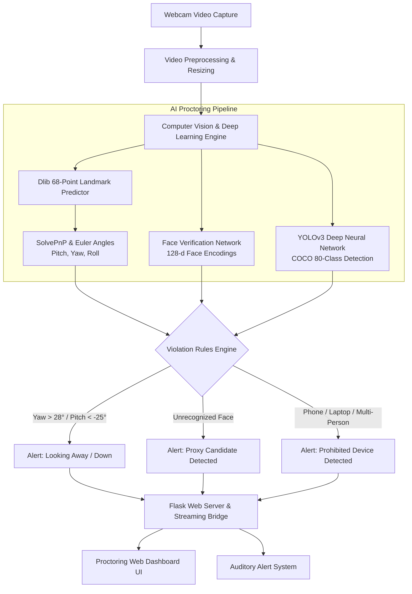

<div align="center">

# 🛡️ Real-Time Automated Exam Invigilation System Using Computer Vision

[](https://www.python.org/)
[](https://opencv.org/)
[](https://palletsprojects.com/p/flask/)
[](https://pjreddie.com/darknet/yolo/)
[](LICENSE)

An intelligent, AI-powered online proctoring and automated invigilation platform that continuously analyzes live webcam streams to ensure academic integrity in remote examinations.

Developed by **[Venkatrao Yasarapu](https://github.com/venkatrao548)**

</div>

---

## 📌 Overview

Remote online examinations often suffer from integrity risks such as unauthorized test-taker substitution, looking away at external reference material or smartphones, and multiple people present in the room.

The **Real-Time Automated Exam Invigilation System** solves this challenge by leveraging modern Computer Vision and Deep Learning pipelines to monitor exam candidates in real time. It features:
- **Head Pose & Gaze Tracking**: Evaluates 3D head orientation (Pitch, Yaw, Roll) via 68-point facial landmarks and Perspective-n-Point (`solvePnP`) to flag candidates looking away, turning sideways, or gazing down at notes.
- **Biometric Candidate Verification**: Verifies candidate facial encodings against registered student records to stop proxy examination attempts.
- **Prohibited Object & Multi-Person Detection**: Employs Darknet YOLOv3 deep neural networks to detect cheating devices (smartphones, laptops, secondary screens, textbooks) and flags the presence of extra persons in the room.
- **Real-Time Glassmorphism Proctor Dashboard**: Interactive web console built with Flask, providing live annotated video feeds, dynamic security event streaming, and auditory alert chimes.

---

## 🏗️ System Architecture



---

## ✨ Key Features

1. **Gaze & Head Pose Estimation**
   - Extracts 68 facial landmark coordinates.
   - Computes 3D Euler angles (Yaw, Pitch, Roll) using an anthropometric 3D face model.
   - Detects head turning (> 28°) and looking down at hidden notes/phones (< -25°).

2. **Continuous Identity Verification**
   - Automatically cross-references incoming facial features with pre-registered exam candidate images.
   - Flags unknown faces or candidate absence immediately.

3. **YOLO Deep Learning Object Detector**
   - Scans exam room for unauthorized objects: **Smartphones, Tablets, Secondary Laptops, and Books**.
   - Monitors candidate count to ensure only a single person is inside the camera frame.

4. **Live Proctoring Dashboard**
   - High-performance MJPEG video stream with visual bounding boxes and pose vector projections.
   - Real-time event log updating every 500ms with instant audio alert cues.
   - Glassmorphism dark-mode UI with start/pause controls and instant incident counters.

---

## 📂 Project Structure

```
automated-exam-invigilation/
├── app.py                      # Flask application server & streaming orchestrator
├── invigilator/
│   ├── __init__.py             # Package initializer
│   ├── head_pose.py            # Dlib 68-point & solvePnP Head Pose Estimator
│   ├── face_recognizer.py      # Facial recognition & intruder detection
│   └── object_detector.py      # Darknet YOLOv3 prohibited object detector
├── models/
│   └── yolo-coco/
│       ├── coco.names          # 80 COCO dataset class labels
│       └── yolov3.cfg          # YOLOv3 model architecture configuration
├── known_faces/                # Registered student photos for authentication
│   └── candidate_sample.jpg    # Sample candidate reference image
├── scripts/
│   └── download_models.py      # Automated script to download model weights
├── static/
│   ├── css/
│   │   └── style.css           # Glassmorphism dark proctor dashboard styles
│   ├── js/
│   │   └── dashboard.js        # Real-time event polling and audio controller
│   ├── alarm.wav               # Security chime audio
│   └── inp.jpg                 # Background banner asset
├── templates/
│   └── index.html              # Modern web-based proctoring dashboard
├── .gitignore                  # Git ignore rules for large weights and virtual environments
├── requirements.txt            # Python package dependencies
└── README.md                   # Comprehensive documentation
```

---

## 🚀 Quickstart & Setup Guide

### 1. Clone the Repository
```bash
git clone https://github.com/venkatrao548/Real-time-automated-exam-invigilation-using-computer-vision-techniuies.git
cd Real-time-automated-exam-invigilation-using-computer-vision-techniuies
```

### 2. Create and Activate Virtual Environment
```bash
# Windows
python -m venv venv
venv\Scripts\activate

# Linux / macOS
python3 -m venv venv
source venv/bin/activate
```

### 3. Install Dependencies
```bash
pip install -r requirements.txt
```

### 4. Download Model Weights
Pretrained deep learning weights (`yolov3.weights` and `shape_predictor_68_face_landmarks.dat`) can be downloaded automatically using our setup utility:
```bash
python scripts/download_models.py
```
> *Note: If model weights are not downloaded, the system will automatically fall back to OpenCV's built-in Haar Cascade detector, ensuring seamless operation out of the box.*

### 5. Launch the Application
```bash
python app.py
```
Open your browser and navigate to:
```
http://127.0.0.1:5000
```

---

## 🛠️ Tech Stack

- **Core Language**: Python 3.9+
- **Computer Vision**: OpenCV (`cv2`), Dlib, NumPy
- **Deep Learning**: Darknet YOLOv3 (DNN Module), Face Recognition (dlib ResNet)
- **Web Framework**: Flask (REST API & MJPEG streaming)
- **Frontend**: HTML5, Modern CSS3 (Glassmorphism), JavaScript (Fetch API), Font Awesome

---

## 👨‍💻 Author

**Venkatrao Yasarapu**
- B.Tech in Computer Science and Engineering
- GitHub: [@venkatrao548](https://github.com/venkatrao548)
- Email: [venkatraoyasarapu0608@gmail.com](mailto:venkatraoyasarapu0608@gmail.com)

---

## 📄 License
This project is open-source and licensed under the [MIT License](LICENSE).
